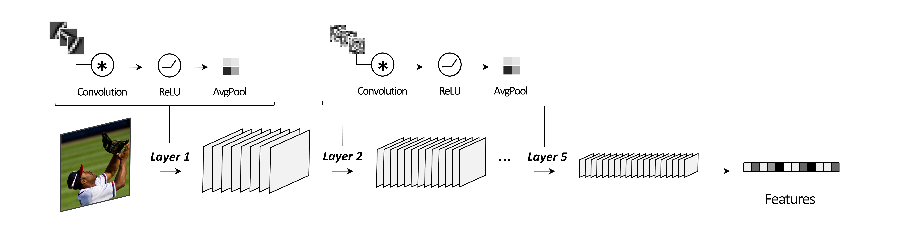

](https://doi.org/10.5281/zenodo.16920087)


[](https://drive.google.com/drive/folders/1e2r25DbYPpsC8wnMadWvwAnwz6xvWWVg)

- [Overview](#overview)
- [System requirements](#system-requirements)
  - [Hardware requirements](#hardware-requirements)
  - [Software requirements](#software-requirements)
- [Installation guide](#installation-guide)
- [Using the Expansion model](#using-the-expansion-model)
- [Running scripts](#running-scripts)
  - [Initial setup](#initial-setup)
  - [Running the demo](#running-the-demo)
  - [Replicating results](#replicating-results)
  - [Dealing with memory issues](#dealing-with-memory-issues)
- [Generating figures](#generating-figures)
- [Information about the datasets](#information-about-the-datasets)
- [License](#license)
- [References](#references)


# Overview


The expansion model is a learning-free convolutional neural network based on compressession in the spatial domain and expansion in the feature domain. To use the model for your own data, please follow the steps incuded in section 1. To reproduce the results from our bioarxiv preprint, refer to section 2. 


# System requirements

## Hardware requirements
 The code requires only a standard computer with enough CPU and GPU compute power to support all operations. The scripts for replicating the main results use about ~18 GB GPU RAM at peak. 


## Software requirements

### OS requirements
The code has been tested on Fedora Linux 39 as well as RHEL 9.3. 

### Python version
The code has been tested on Python==3.12

### Python dependencies
The following is a list of python libraries required to run all scripts:
```
pillow
opencv-python
loguru
matplotlib
numpy
pandas
scipy
seabor
scikit-learn
timm
torch
torchmetrics
torchvision
tqdm
xarray
netCDF4
cupy-cuda12x
```

# Installation guide

Run:

```
git clone https://github.com/akazemian/untrained_models_of_visual_cortex.git
cd untrained_models_of_visual_cortex
conda create -n expansion_project python==3.12
conda activate expansion_project
pip install -e .
```

# Using the Expansion model

Below is an example of how to use the expansion model. Alternatively, you can navigate to `notebooks/main.ipynb` for an example.

1. Import the model
```python
from expansion import Expansion5L
```

2. Import (preprocessed) images as a torch tensor. Below is a random image tensor of size NxCxHxW. Where N = number of images, C = number of channels, H = height of the image, W = width of the image.
   
```python
X = troch.Tensor(1,3,224,224)
```

3. Instantiate the model
```python
expansion_model = Expansion5L(filters_5 = 3000, # number of filters in the last convolution layer of the model
                              device='cuda').Build()

```

4. Extract image features
```python
features = expansion_model(X)
```

The ouput is a tensor of size NxP, where N = the number of image and P = the number of features in the last layer of the model.

# Running scripts 

## Initial Setup

1. Download the data used in all analysis [here](https://drive.google.com/drive/folders/1e2r25DbYPpsC8wnMadWvwAnwz6xvWWVg?usp=sharing) and unzip each dataset folder. The download may take a while given the size of the datasets (~100 GB). If you're only running the demo, download the `majajhong` and `places` folders.

2. In the root directory, open `config` and set the paths for the `CACHE` (where intermediate results will be saved) and `DATA` (where the data was downloaded) folders. 


## Running the demo
For analyses involving neural data, a subset of the majajhong dataset (50 images) is used. For image classification, a subset of the Places train (500 images) and validation set (500 images) is used. Further, only the smallest version of the untrained models are used. Running the demo scripts as shown below produces all demo results, and figures can be generated in `demo/notebooks`.

(<5 minutes) To generate the main results, run: 
```
python -m demo.main.engineered_models
python -m demo.supplementary.sota_models --model alexnet_trained
python -m demo.main.pca_analysis
python -m demo.main.local_connectivity
python -m demo.main.classification
```

(5 minutes) To generate the supplementary results, run: 
```
python -m demo.supplementary.ablations 
python -m demo.supplementary.init_type 
python -m demo.supplementary.non_linearity
python -m demo.supplementary.sota_models 
python -m demo.supplementary.var_partitioning_majajhong
python -m demo.supplementary.majajhong_nc 
python -m demo.supplementary.pecent_variance_explained 
```

## Replicating results

Navigate to the project directory and make sure to specify the dataset (`majajhong` or `naturalscenes`) when running the following. 

For instance, to generate the main results for `majajhong`, run: 
```
python -m code_.scripts.main.engineered_models --dataset majajhong
python -m code_.scripts.supplementary.sota_models --model alexnet_trained --dataset majajhong
python -m code_.scripts.main.pca_analysis --dataset majajhong
python -m code_.scripts.main.local_connectivity --dataset majajhong
python -m code_.scripts.main.classification --dataset majajhong
```

To generate the supplementary results for `majajhong`, run: 
```
python -m code_.scripts.supplementary.ablations --dataset majajhong
python -m code_.scripts.supplementary.init_type --dataset majajhong
python -m code_.scripts.supplementary.non_linearity --dataset majajhong
python -m code_.scripts.supplementary.sota_models --dataset majajhong
python -m code_.scripts.supplementary.var_partitioning_majajhong --dataset majajhong
python -m code_.scripts.supplementary.majajhong_nc --dataset majajhong
python -m code_.scripts.supplementary.pecent_variance_explained --dataset majajhong
```

## Dealing with memory issues

If there are any memory issues when running the above, try:
- changing the batch size with --batchsize.
- changing the device between cpu and gpu.
  
# Generating figures

Navigate to the `notebooks` folder. Here you will find notebooks for generating each figure individually. These are saved in the `figures` folder. If you're only running the demo, you can generate demo figures in `demo/notebooks`.

# Information about the datasets:

When generating the results, the stimuli and preprocessed neural data are downloaded using the DATA path set earlier. This is done to increase efficiency. Alternatively, information about how to download and process the raw data manually is described below. The code used for preprocessing the neural data can be found in `code_/encoding_score/processing`

## The Majajhong dataset 

**Data**: The monkey electrophysiology dataset (Majaj et al., 2015) is available as part of the [Brain-score GitHub package](https://github.com/brain-score):. 

**Preprocessing**: We use the average response to stimuli across repetitions. 

## The Naturalscenes dataset:

Data: The Natural Scenes Dataset human fMRI dataset (Allen et al., 2022) can be downloaded [here](https://naturalscenesdataset.org/). 

Preprocessing: We use the NSD single-trial betas, preprocessed in 1.8-mm volume space and denoised using the GLMdenoise technique (version 3; “betas_fithrf_GLMdenoise_RR”) (Kay et al., 2013). We converted the betas to z-scores within each scanning session and computed the average betas for each NSD stimulus across repetitions. 


## The Places dataset:

Data: The Places dataset (Zhou et al, 2018) can be downloaded [here](http://places2.csail.mit.edu/)

# License

This project is covered under the MIT License.

# References

Allen, E. J., St-Yves, G., Wu, Y., Breedlove, J. L., Prince, J. S., Dowdle, L. T., Nau, M., Caron, B., Pestilli, F., Charest, I., Hutchinson, J. B., Naselaris, T., & Kay, K. (2022). A massive 7T fMRI dataset to bridge cognitive neuroscience and artificial intelligence. Nature Neuroscience, 25(1), 116–126. https://doi.org/10.1038/s41593-021-00962-x 

Majaj, N. J., Hong, H., Solomon, E. A., & DiCarlo, J. J. (2015). Simple Learned Weighted Sums of Inferior Temporal Neuronal Firing Rates Accurately Predict Human Core Object Recognition Performance. Journal of Neuroscience, 35(39), 13402–13418. https://doi.org/10.1523/JNEUROSCI.5181-14.2015 

Zhou, B., Lapedriza, A., Khosla, A., Oliva, A., & Torralba, A. (2018). Places: A 10 Million Image Database for Scene Recognition. IEEE Transactions on Pattern Analysis and Machine Intelligence, 40(6), 1452–1464. https://doi.org/10.1109/TPAMI.2017.2723009 


  
  
